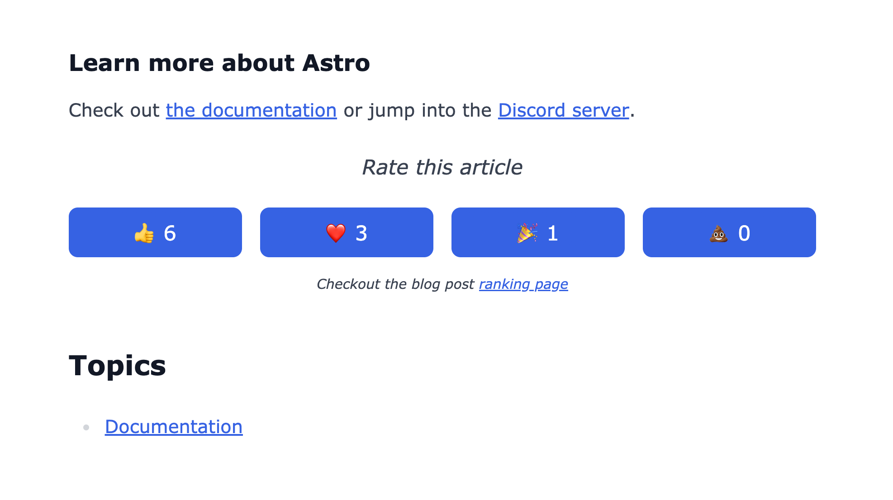
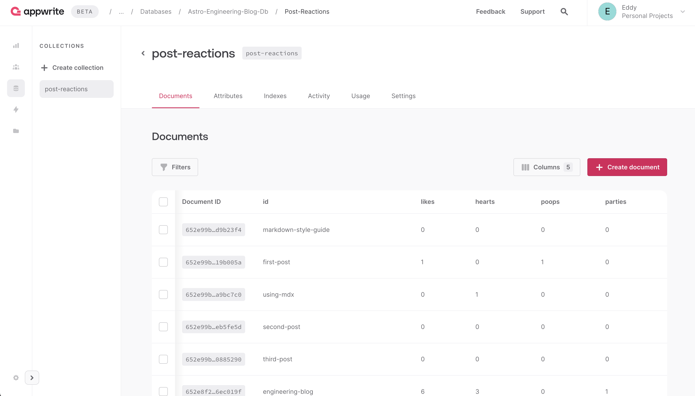
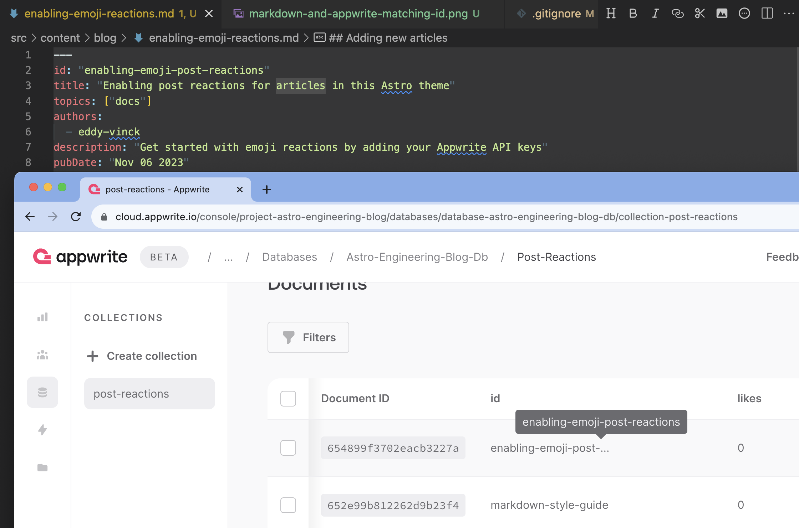

Emoji reactions are reaction buttons added to every article in this Astro theme. This is an optional add-on feature which can be enabled by adding an Appwrite API key and a few other environment variables.

If you don't want this feature for your engineering blog, you can leave the API key value empty and the functionality will gracefully disappear without you having to remove the code. The API endpoints used will just return a `500` internal server error, the ranking page will redirect to a `404` status page, and the related components to react to posts are not rendered.

If you do want to remove the code, you can see which files you need to remove or edit at the bottom of this page.



To add this functionality, all you need to do is:

- Create an [Appwrite account](https://cloud.appwrite.io/register) (the free tier is good enough)
- Create a project in Appwrite
- Create an API key with the Database scope
- Add the API key to your `/.env` file (do not add this to Git)
- Choose a name for the database and add it in your `.env`

It should look something like this:

```bash
# in /.env
SECRET_APPWRITE_API_KEY=YOUR_APPWRITE_API_KEY
PUBLIC_APPWRITE_ENDPOINT=https://cloud.appwrite.io/v1
PUBLIC_APPWRITE_PROJECT_ID=your-engineering-blog-name
PUBLIC_APPWRITE_DATABASE_ID=your-engineering-blog-name-db
PUBLIC_APPWRITE_EMOJI_REACTIONS_COLLECTION_ID=post-reactions
```

If you follow those steps and run `npm run dev`, the following will happen:

- Astro will run `getStaticPaths` in `src/pages/blog/[...page].astro`
- This will run `tryInitNewBlogPostsReactionsInDatabaseCollection` which will try to create your Appwrite database and the Collection for your post reactions
- It will create a Document in the post-reactions Collection for every blog post with the initial state of 0 reactions

If everything goes well, you should be able to find the collection in your Appwrite project. It should look something like this:



## Adding new articles

To trigger the instantiation of the post reactions for a new article, you'll need to refresh the [/blog](/blog) page so that the `getStaticPaths` function runs.

In `src/pages/blog/[...page].astro` you can see how the implementation of `getStaticPaths` will try to initialize the post reactions in your Appwrite database collection if you have added your Appwrite API key as an environment variable.

## Troubleshooting

### Why is my blog post not showing up on the ranking page?

You need to make sure the ID in your blog post's frontmatter section matches the ID in the Appwrite Collection for your post reactions.

Here you can see the matching ID in the markdown file and in Appwrite for the article with the ID `"enabling-emoji-post-reactions"`:



### Why does my blog post not show the emoji reaction buttons?

Your new blog posts are automatically added to the Collection in Appwrite when visiting the `/blog` route. If you refresh that route, the emoji reactions should then show up when you open the blog post the next time.

## Removing the post reactions code from your theme

You can remove these directories entirely:

- `src/components/backend-services`
- `src/pages/api`
- `src/lib/appwrite`

These files can be deleted:

- `src/pages/blog-ranking.astro`
- `src/lib/ratelimit.ts`

These files need to be edited:

- Remove the code inside the if-statement which checks`SECRET_APPWRITE_API_KEY` from `src/pages/blog/[...page].astro`
- Remove the `<EmojiReactions />` component from `src/layouts/BlogPost.astro`

And lastly, don't forget to remove the Appwrite dependencies from your `package.json` by running this command:

```bash
npm uninstall appwrite node-appwrite
```
